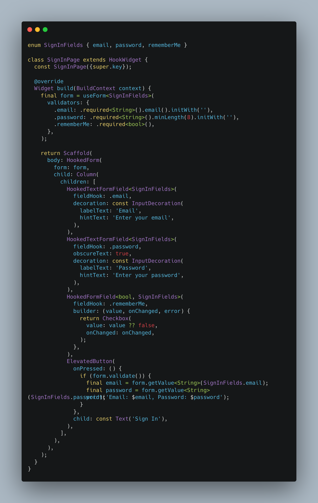
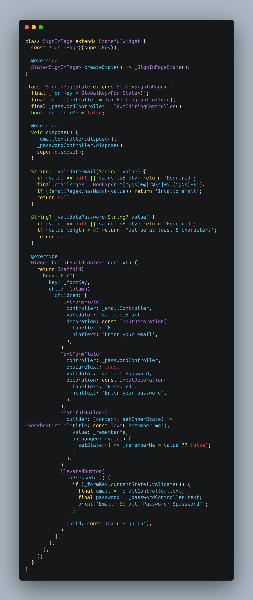

# flutter_hook_form

A type-safe, schema-driven form controller for Flutter, inspired by _react-hook-form_ and _Zod_. It ships with an optional `flutter_hooks` integration (`useForm`) for the most convenient setup, but the core `FormFieldsController` has no dependency on `flutter_hooks` and can be instantiated however fits your app.

`flutter_hook_form` gives you a single, typed source of truth for a form's fields, values, and validation rules — without asking you to rebuild your UI around a bundled widget library.

<table>
<tr>
<th align="left">flutter_hook_form</th>
<th align="left">Vanilla Flutter (<code>Form</code> + <code>GlobalKey&lt;FormState&gt;</code>)</th>
</tr>
<tr>
<td></td>
<td></td>
</tr>
</table>

Same `SignInPage`, side by side: no `TextEditingController` to create or dispose, no duplicated email/password validation logic, no manual `bool` field wired through `setState`.

## Why flutter_hook_form?

Most Flutter form packages solve forms the same way: they ship their own text field, their own dropdown, their own date picker, and ask you to rebuild your screens around them to get validation and state management "for free." That's a real cost — you either give up your design system, or you maintain two ways of building inputs.

`flutter_hook_form` takes a different approach:

- **Bring your own widgets, always.** `HookedFormField` turns *any* widget — your design system's button, a third-party date picker, a `Slider`, a signature pad — into a controlled, validated form field. `HookedTextFormField`/`HookedFormField` are convenience wrappers, not a requirement: nothing in this package asks you to replace the inputs you already use.

- **Reading values isn't a `GlobalKey<FormState>` scavenger hunt.** A plain `Form` + `GlobalKey<FormState>` gives you validation, but getting typed values back out means a `TextEditingController` per field, manual casting, or `FormState.value` archaeology. Here, `form.getValue<String>(.email)` and `form.getValues()` return typed values directly from the controller — no controllers to create, dispose, or keep in sync.

- **Zod-style centralized schemas — opt-in, not imposed.** Declare your fields once as an enum and describe each one fluently: `.required<String>().email().minLength(8)`. Every screen using that schema enforces the same rules, so validation logic stops drifting between widgets. If a field's logic really only makes sense next to that one widget, skip the schema for it and pass `validator:` directly — both styles compose in the same form.

- **Granular reactivity.** `form.listen({.email, .password}, ...)` rebuilds only the widgets watching those specific fields, not the whole form, without wiring up a separate state management layer.

### How it compares to a vanilla `Form`

| | `flutter_hook_form` | Vanilla `Form` |
|---|---|---|
| Bring your own widgets | ✅ any widget via `HookedFormField` | ✅ but all wiring is manual |
| Typed value access | ✅ `form.getValue<T>(field)` | ❌ one controller per field |
| Centralized, reusable schema | ✅ enum + fluent `FieldConfig` | ❌ |
| Cross-field validation | ✅ built-in (`.matcheField`, `.dateAfterField`) | ❌ manual |
| Granular rebuilds on field change | ✅ `form.listen({...})` | ❌ |
| Focus + scroll to first invalid field | ✅ built-in (`focusOnInvalid`) | ❌ manual |
| No controllers to create/dispose | ✅ | ❌ |

## What's New

The schema API has been reworked around `FieldConfig` — a fluent, chainable builder (`.required<String>().email().minLength(8).initWith('')`) that replaces the previous per-enum-value validator lists. Field enums are now plain Dart enums — no interface to implement. `useForm` also gained `focusOnInvalid` and `autoScrollWhenFocusOnInvalid`, so a failed `form.validate()` can automatically focus (and scroll to) the first invalid field.

## Motivation

Managing forms in Flutter often means creating multiple `TextEditingController` instances, tracking their lifecycle, and scattering validation logic across widgets. This package exists to:

- **Centralize validation logic**: describe all your form fields and their rules in a single, fluent schema — while still allowing per-widget overrides when that's a better fit.
- **Make field values easy to reach**: read and update typed values directly from the form controller, with no extra state manager or dependency injection required.

## Table of Contents

- [How to use](#how-to-use)
  - [Install](#install)
  - [Minimal example](#minimal-example)
  - [Create your Schema](#create-your-schema)
    - [Available Validators](#available-validators)
    - [Cross-Field Validators](#cross-field-validators)
    - [Create validators](#create-validators)
      - [Making a custom validator chainable](#making-a-custom-validator-chainable)
  - [Use "hooked" widgets](#use-hooked-widgets)
    - [Use form controller](#use-form-controller)
    - [HookedTextFormField](#hookedtextformfield)
    - [HookedFormField](#hookedformfield)
    - [Overriding a field's validator inline](#overriding-a-fields-validator-inline)
    - [Focus on Invalid Field](#focus-on-invalid-field)
    - [Form State Management](#form-state-management)
    - [Reactive Field Listening](#reactive-field-listening)
    - [Form Field State](#form-field-state)
- [Customizations](#customizations)
  - [Custom Validation Messages & Internationalization](#custom-validation-messages--internationalization)
  - [Form Injection and Context Access](#form-injection-and-context-access)
  - [Alternative Injection Methods](#alternative-injection-methods)
  - [Write your own Form field](#write-your-own-form-field)
- [Use Cases](#use-cases) *(see [doc/USE_CASES.md](doc/USE_CASES.md))*
- [Additional Information](#additional-information)

## How to use

### Install

Add `flutter_hook_form` to your dependencies in `pubspec.yaml`:

```yaml
dependencies:
  flutter_hook_form: ^5.0.0-beta.1
```

`flutter_hooks` is **not** a hard requirement — it's only needed if you use the `useForm` hook, which is the most convenient way to create a `FormFieldsController` inside a `HookWidget`. If you'd rather instantiate the controller yourself (Riverpod, GetIt, plain `StatefulWidget`, ...), skip it entirely; see [Alternative Injection Methods](#alternative-injection-methods).

```yaml
dependencies:
  flutter_hook_form: ^5.0.0-beta.1

  # Only required if you use the useForm hook
  flutter_hooks: ">=0.18.4 <1.0.0"
```

### Minimal example

The smallest possible form: one field, one validator.

```dart
enum LoginFields { email }

class MinimalPage extends HookWidget {
  const MinimalPage({super.key});

  @override
  Widget build(BuildContext context) {
    final form = useForm<LoginFields>(
      validators: {.email: .required<String>().email().initWith('')},
    );

    return HookedForm(
      form: form,
      child: HookedTextFormField<LoginFields>(fieldHook: .email),
    );
  }
}
```

The rest of this section builds up from there: schema syntax, validators, cross-field rules, and the widgets that connect them to your UI.

### Create your Schema

Define your form fields as a plain enum, then describe each field's validation (and, optionally, its initial value) with `FieldConfig`'s fluent builder:

```dart
import 'package:flutter_hook_form/flutter_hook_form.dart';

enum SignInFields { email, password, rememberMe }

// Wherever you create the form:
final form = useForm<SignInFields>(
  validators: {
    .email: .required<String>().email().initWith(''),
    .password: .required<String>().minLength(8).initWith(''),
    .rememberMe: .required<bool>(),
  },
);
```

Every `FieldConfig<T>` chain starts from `.required<T>()` or `.optional<T>()` and reads like a sentence: pick the base rule, then chain the type-specific checks that apply. `.initWith(value)` sets the field's initial value.

#### Available Validators

The package comes with several built-in validators, exposed both as fluent `FieldConfig` methods and as standalone classes:

| Category | `FieldConfig` method | Validator class | Description |
|----------|-----------------------|------------------|-------------|
| **Generic** | `.required()` | `RequiredValidator<T>` | Ensures the field is not empty |
| | `.optional()` | `OptionalValidator<T>` | Ensures the field, if present, matches type `T` |
| **String** | `.email()` | `EmailValidator` | Validates email format |
| | `.minLength(8)` | `MinLengthValidator` | Checks minimum length |
| | `.maxLength(32)` | `MaxLengthValidator` | Checks maximum length |
| | `.phone()` | `PhoneValidator` | Validates phone number format |
| | `.pattern(RegExp(...))` | `PatternValidator` | Validates against a regular expression |
| **Number** | `.min(0)` | `MinValidator` | Checks minimum value |
| | `.max(100)` | `MaxValidator` | Checks maximum value |
| | `.range(0, 100)` | `RangeValidator` | Checks value is within a range |
| **Date** | `.isAfter(date)` | `IsAfterValidator` | Validates minimum date |
| | `.isBefore(date)` | `IsBeforeValidator` | Validates maximum date |
| **List** | `.minItems(2)` | `ListMinItemsValidator<T>` | Checks minimum items |
| | `.maxItems(5)` | `ListMaxItemsValidator<T>` | Checks maximum items |
| **File** | `.mimeType({...})` | `MimeTypeValidator` | Validates file MIME type |
| **Cross-Field** | `.dateAfterField(.startDate)` | `DateAfterValidator` | Validates a date is after another field's date |
| | `.matcheField(.password)` | `MatchesValidator<T>` | Validates the value matches another field's value |

Chained methods run in the order they're called, and stop at the first error.

#### Cross-Field Validators

Cross-field validators compare a field's value against another field's value. They resolve the other field through `BuildContext`, so they only work inside a `HookedForm`/`HookedFormProvider` subtree.

```dart
enum RegistrationFields {
  password,
  confirmPassword,
  startDate,
  endDate,
}

final form = useForm<RegistrationFields>(
  validators: {
    .password: .required<String>().minLength(8),
    .confirmPassword: .required<String>().matcheField(
      RegistrationFields.password,
      message: 'Passwords must match',
    ),
    .startDate: .required<DateTime>(),
    .endDate: .required<DateTime>().dateAfterField(
      RegistrationFields.startDate,
      message: 'End date must be after start date',
    ),
  },
);
```

##### Creating Custom Cross-Field Validators

Extend `CrossFieldValidator<T, E>` to compare against another field:

```dart
class PasswordStrengthValidator<E extends Enum>
    extends CrossFieldValidator<String, E> {
  const PasswordStrengthValidator({required super.field, super.message})
    : super(errorCode: 'password_too_similar');

  @override
  CrossFieldValidatorFn<String> get validator {
    return (value, context) {
      if (value == null) return null;

      final form = useFormContext<E>(context);
      final usernameValue = form.getValue<String>(field);

      if (usernameValue != null && value.contains(usernameValue)) {
        return message ?? errorCode;
      }

      return null;
    };
  }
}

// Usage
enum SecurityFields { username, password }

final form = useForm<SecurityFields>(
  validators: {
    .username: .required<String>(),
    .password: FieldConfig<String>().required().merge(
      PasswordStrengthValidator(
        field: SecurityFields.username,
        message: 'Password cannot contain your username',
      ),
    ),
  },
);
```

#### Create validators

Create custom field-level validators by extending `FieldValidator<T>`. Return `errorCode` on failure to support internationalization (see [Custom Validation Messages & Internationalization](#custom-validation-messages--internationalization)). Once you have one, see [Making a custom validator chainable](#making-a-custom-validator-chainable) to give it the same fluent, discoverable feel as the built-ins.

```dart
class UsernameValidator extends FieldValidator<String> {
  const UsernameValidator() : super(errorCode: 'username_error');

  @override
  FieldValidatorFn<String> get validator => (value) {
    if (value?.contains('@') == true) {
      return errorCode;
    }
    return null;
  };
}

// Use it via `.merge`
final usernameConfig = FieldConfig<String>()
    .required()
    .merge(const UsernameValidator());
```

Custom validators can carry their own parameters:

```dart
class MinAgeValidator extends FieldValidator<DateTime> {
  const MinAgeValidator(this.minAge, {super.message, String? errorCode})
    : super(errorCode: errorCode ?? 'min_age_error');

  final int minAge;

  @override
  FieldValidatorFn<DateTime> get validator => (value) {
    if (value == null) return null;

    final age = DateTime.now().year - value.year;
    if (age < minAge) {
      return message ?? errorCode;
    }
    return null;
  };
}
```

#### Making a custom validator chainable

A custom validator works right away with `.merge()`:

```dart
final config = FieldConfig<DateTime>().required().merge(const MinAgeValidator(18));
```

That's fine for a one-off use, but it doesn't read like the built-in `.required().minLength(8)` chain, and it doesn't show up in autocomplete next to them. Add an extension on `FieldConfig<T>` for the type your validator applies to, and it becomes a first-class citizen of the fluent API — exactly like `.email()` or `.minLength()` are:

```dart
extension FieldConfigMinAge on FieldConfig<DateTime> {
  FieldConfig<DateTime> minAge(
    int years, {
    String? message,
    String? errorCode,
  }) {
    return merge(MinAgeValidator(years, message: message, errorCode: errorCode));
  }
}
```

```dart
final form = useForm<ProfileFields>(
  validators: {
    .birthDate: .required<DateTime>().minAge(18),
  },
);
```

Both approaches use the same `merge` under the hood — the extension is purely about giving your validator the same discoverable, chainable feel as the built-ins. Group related extensions in one file per project (a `field_config_extensions.dart`, say) and every schema in the app gets to use them.

### Use "Hooked" widgets

`flutter_hook_form` includes convenient form widgets to streamline development. They're entirely optional — they wrap Flutter's standard `Form`, `FormField`, and `TextFormField`, and any widget can be turned into a form field with `HookedFormField` without using them at all.

#### Use form controller

The `useForm` hook requires `flutter_hooks` and can only be used within a `HookWidget` or `HookConsumerWidget`.

```dart
// Correct usage
class MyForm extends HookWidget {
  @override
  Widget build(BuildContext context) {
    final form = useForm<MyFields>(validators: {/* ... */});
    // ...
  }
}

// Also correct with Riverpod
class MyForm extends HookConsumerWidget {
  @override
  Widget build(BuildContext context, WidgetRef ref) {
    final form = useForm<MyFields>(validators: {/* ... */});
    // ...
  }
}
```

If you need to use the form controller in a regular (non-hook) widget, you can either:

1. Use `FormFieldsController` directly
2. Access it through `useFormContext` (see [Form Injection and Context Access](#form-injection-and-context-access))
3. Use any other dependency injection method (see [Alternative Injection Methods](#alternative-injection-methods))

#### HookedTextFormField

`HookedTextFormField` wraps Flutter's `TextFormField` and connects it to the form controller:

```dart
HookedTextFormField<SignInFields>(
  fieldHook: .email,
  decoration: const InputDecoration(
    labelText: 'Email',
    hintText: 'Enter your email',
  ),
)
```

#### HookedFormField

`HookedFormField<T, E>` is a generic form field that turns any widget into a controlled field — this is what lets you keep using your own components instead of a bundled widget set:

```dart
HookedFormField<bool, SignInFields>(
  fieldHook: .rememberMe,
  builder: (value, onChanged, error) {
    return Checkbox(
      value: value ?? false,
      onChanged: onChanged,
    );
  },
)
```

Here's a complete sign-in form using both widgets:

```dart
enum SignInFields { email, password, rememberMe }

class SignInPage extends HookWidget {
  const SignInPage({super.key});

  @override
  Widget build(BuildContext context) {
    final form = useForm<SignInFields>(
      validators: {
        .email: .required<String>().email().initWith(''),
        .password: .required<String>().minLength(8).initWith(''),
        .rememberMe: .required<bool>(),
      },
    );

    return Scaffold(
      body: HookedForm(
        form: form,
        child: Column(
          children: [
            HookedTextFormField<SignInFields>(
              fieldHook: .email,
              decoration: const InputDecoration(
                labelText: 'Email',
                hintText: 'Enter your email',
              ),
            ),
            HookedTextFormField<SignInFields>(
              fieldHook: .password,
              obscureText: true,
              decoration: const InputDecoration(
                labelText: 'Password',
                hintText: 'Enter your password',
              ),
            ),
            HookedFormField<bool, SignInFields>(
              fieldHook: .rememberMe,
              builder: (value, onChanged, error) {
                return Checkbox(
                  value: value ?? false,
                  onChanged: onChanged,
                );
              },
            ),
            ElevatedButton(
              onPressed: () {
                if (form.validate()) {
                  final email = form.getValue<String>(SignInFields.email);
                  final password = form.getValue<String>(SignInFields.password);
                  print('Email: $email, Password: $password');
                }
              },
              child: const Text('Sign In'),
            ),
          ],
        ),
      ),
    );
  }
}
```

#### Overriding a field's validator inline

Every "hooked" widget accepts a `validator:` parameter that overrides whatever is declared in the schema for that field — useful when a check genuinely only makes sense next to that one widget (e.g. it needs runtime data unavailable to the schema):

```dart
final _urlPattern = RegExp(r'^https?:\/\/([\da-z\.-]+)\.([a-z\.]{2,6})([\/\w \.-]*)*\/?$');

HookedTextFormField<ProfileFields>(
  fieldHook: .website,
  decoration: const InputDecoration(labelText: 'Website (optional)'),
  validator: (value) => FieldConfig<String>()
      .required()
      .pattern(_urlPattern)
      .validate(value ?? '', context),
)
```

#### Focus on Invalid Field

`useForm` accepts `focusOnInvalid` and `autoScrollWhenFocusOnInvalid` to automatically move focus to (and scroll to) the first invalid field whenever `form.validate()` fails — the field declared first in your enum wins if several are invalid.

```dart
final form = useForm<SignInFields>(
  validators: {/* ... */},
  focusOnInvalid: true, // defaults to false
  autoScrollWhenFocusOnInvalid: true, // defaults to true, only matters if focusOnInvalid is true
);
```

`HookedTextFormField` wires this up automatically — it registers its `focusNode` (yours, or one created for you) with the controller. Both options can also be overridden per call:

```dart
form.validate(focusOnInvalid: true, autoScrollWhenFocusOnInvalid: false);
```

For a custom `HookedFormField`, grab the managed `FocusNode` yourself and wire it into your input:

```dart
HookedFormField<bool, SignInFields>(
  fieldHook: .rememberMe,
  builder: (value, onChanged, error) {
    final form = useFormContext<SignInFields>(context);
    return Checkbox(
      focusNode: form.focusNodeFor(.rememberMe),
      value: value ?? false,
      onChanged: onChanged,
    );
  },
)
```

#### Form State Management

The form controller provides several methods to manage form state:

```dart
// Update a field value
form.updateValue(.email, 'new@email.com');

// Get a field value
final email = form.getValue<String>(SignInFields.email);

// Get all form values
final values = form.getValues();

// Reset the form
form.reset();

// Validate the form
final isValid = form.validate();
```

#### Reactive Field Listening

Use `form.listen` inside a `HookWidget` to subscribe to one or more fields and derive state. The widget rebuilds only when the watched fields change — no separate state manager required.

```dart
class SignInButton extends HookWidget {
  @override
  Widget build(BuildContext context) {
    final form = useFormContext<SignInFields>(context);

    // Rebuilds only when email or password changes
    final canSubmit = form.listen(
      {SignInFields.email, SignInFields.password},
      (get) =>
          get<String>(SignInFields.email) != null &&
          get<String>(SignInFields.password) != null,
    );

    return ElevatedButton(
      onPressed: canSubmit ? () => submitForm(form) : null,
      child: const Text('Sign In'),
    );
  }
}
```

You can also listen to a single field and read its current value:

```dart
final email = form.listen(
  {SignInFields.email},
  (get) => get<String>(SignInFields.email),
);
```

For use outside a `HookWidget` (e.g. with `ValueListenableBuilder`), use `form.getNotifier` directly:

```dart
ValueListenableBuilder<String?>(
  valueListenable: form.getNotifier<String>(SignInFields.email),
  builder: (context, email, _) => Text('Email: ${email ?? '—'}'),
)
```

#### Form Field State

You can also access the state of individual form fields:

```dart
// Check if fields have been modified
final isDirty = form.isDirty({.email, .password});

// Check if a specific field is valid
final isEmailValid = form.validateField(.email);

// Get field error message
final error = form.getFieldError(.email);
```

## Customizations

### Custom Validation Messages & Internationalization

Override the `FormErrorMessages` class and provide it via `HookFormScope` to translate error messages.

```dart
class CustomFormMessages extends FormErrorMessages {
  const CustomFormMessages(this.context);

  final BuildContext context;

  @override
  String get required => 'This field is required.';

  @override
  String get invalidEmail => AppLocalizations.of(context).invalidEmail;

  String minAgeError(int age) => 'You must be $age to use this.';

  @override
  String? parseErrorCode(String errorCode, dynamic value) {
    return switch (errorCode) {
      'min_age_error' when value is int => minAgeError(value),
      _ => null,
    };
  }
}

class MyApp extends StatelessWidget {
  @override
  Widget build(BuildContext context) {
    return MaterialApp(
      builder: (context, child) => HookFormScope(
        messages: CustomFormMessages(context),
        child: child ?? const SignInPage(),
      ),
    );
  }
}
```

### Form Injection and Context Access

Use `HookedForm` to inject the form controller into the widget tree and retrieve it with `useFormContext` in child widgets — this is how you keep large forms broken into small, focused, reusable widgets instead of one giant `build` method.

```dart
class ParentWidget extends HookWidget {
  @override
  Widget build(BuildContext context) {
    final form = useForm<SignInFields>(validators: {/* ... */});

    return HookedForm(
      form: form,
      child: const Column(
        children: [ChildWidget()],
      ),
    );
  }
}

class ChildWidget extends StatelessWidget {
  const ChildWidget({super.key});

  @override
  Widget build(BuildContext context) {
    final form = useFormContext<SignInFields>(context);

    return // ... child widget
  }
}
```

#### Navigating with the form instance

When navigating, a new widget tree is generated and you may lose access to the form instance. Use `HookedFormProvider` to provide the form to the new widget tree:

```dart
showBottomSheet(
  context: context,
  builder: (context) {
    return HookedFormProvider(
      form: form,
      child: const MySubForm(),
    );
  },
);
```

### Alternative Injection Methods

While `HookedForm` is the recommended way to inject form controllers, you can use any other dependency injection method — `flutter_hook_form` doesn't require flutter_hooks-based DI to work.

#### Using Riverpod

```dart
final signInFormProvider = Provider<FormFieldsController<SignInFields>>((ref) {
  return FormFieldsController(GlobalKey<FormState>());
});

class SignInForm extends HookConsumerWidget {
  @override
  Widget build(BuildContext context, WidgetRef ref) {
    final form = ref.watch(signInFormProvider);

    return HookedForm(
      form: form,
      child: // ... form fields
    );
  }
}
```

#### Using GetIt

```dart
final getIt = GetIt.instance;

void setupDependencies() {
  getIt.registerLazySingleton<FormFieldsController<SignInFields>>(
    () => FormFieldsController(GlobalKey<FormState>()),
  );
}

class SignInForm extends HookWidget {
  @override
  Widget build(BuildContext context) {
    final form = getIt<FormFieldsController<SignInFields>>();

    return HookedForm(
      form: form,
      child: // ... form fields
    );
  }
}
```

### Write your own Form field

"Hooked" widgets simply wrap Flutter's standard `FormField` and `TextFormField`. Since `HookedFormField` already covers "any widget, any type," writing a fully custom field is only necessary when you want full control over the underlying `FormField`.

To create your own custom form field:

1. Connect to the form controller (either via `useFormContext` or by passing it directly)
2. Use `form.fieldKey(field)` to connect the field to the form
3. Handle validation and error display
4. Register value changes with `form.updateValue`

Here's an example of a custom checkbox form field:

```dart
class CustomCheckboxField<E extends Enum> extends StatelessWidget {
  const CustomCheckboxField({
    super.key,
    required this.field,
    required this.label,
  });

  final E field;
  final String label;

  @override
  Widget build(BuildContext context) {
    final form = useFormContext<E>(context);

    return FormField<bool>(
      key: form.fieldKey(field),
      initialValue: form.getInitialValue(field) ?? false,
      builder: (fieldState) {
        return Row(
          children: [
            Checkbox(
              value: fieldState.value ?? false,
              onChanged: (value) {
                fieldState.didChange(value);
                form.updateValue(field, value);
              },
            ),
            Text(label),
            if (fieldState.hasError)
              Text(
                fieldState.errorText!,
                style: const TextStyle(color: Colors.red),
              ),
          ],
        );
      },
    );
  }
}
```

## Use Cases

Payload conversion, async validation, and lower-level controller methods (`setError`, `hasBeenInteracted`, `hasChanged`, ...) are covered in [doc/USE_CASES.md](doc/USE_CASES.md).

## Additional Information

### Dependencies

- flutter_hooks: `>=0.18.4 <1.0.0`

### Contributing

Contributions are welcome! Please feel free to submit a Pull Request.

### License

This project is licensed under the MIT License - see the [LICENSE](LICENSE) file for details.

## Support

If you encounter any issues or have questions, please file an issue on the [GitHub repository](https://github.com/kylianSalomon/flutter_hook_form/issues).
